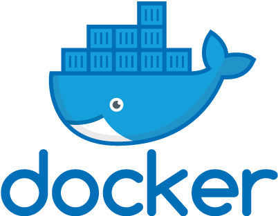

# Docker คืออะไรและดียังไง
Docker คือสิ่งที่มาช่วยชีวิตเหล่า Developer โดยทำให้วงจรในการพัฒนาแอพง่ายขึ้น และช่วยลดคำพูดที่คุ้นหูว่า `"ทำไมมันทำงานไม่ได้ฟระ ทั้งๆที่ในเครื่องผมยังทำงานได้อยู่เลย"` (คุ้นปะ)

> **ตัวอย่างปลากรอบ**  
สมมุติว่าเราต้องไปเขียนเว็บซักตัวที่เป็นภาษา php เราต้องทำอะไรบ้าง? ลง webserver? ลง mySQL? ตั้งค่าเซิฟเวอร์ต่างๆ บลาๆๆๆ ... ซึ่งถ้าไม่ทำของพวกนี้ก็ run php ไม่ได้ใช่ปะ? และขั้นตอนที่ว่ามาทั้งหมดมันก็อยู่กับ**เครื่องเราเอง**เท่านั้น ซึ่งถ้าเราเอาเว็บที่เขียนไปใส่ในเซิฟเวอร์ แต่ลืมตั้งค่าเซิฟเวอร์ให้เหมือนเครื่องเราละ? หรือเวอร์ชั่นของ php ในเครื่องกับเซิฟเวอร์ไม่ตรงกันละ? มันจะทำงานได้ปะ? แล้วถ้าเราทำงานกับเพื่อนๆ เรากับเพื่อนก็ต้องตั้งค่าต่างๆให้เหมือนกันอีกนะ! ถ้ามีคนไปเปลี่ยนก็ต้องบอกให้ทุกคนเปลี่ยนตามกันด้วย!!  
เห็นมะแค่เกริ่นก็ปวดกบาลละ แต่ทั้งหมดนี่ถ้าเราใช้ docker ปัญหาที่ว่ามาจะหมดไป! (บร๊ะ...เหมือนโฆษณาหลอกขายเลย)

# Docker ทำงานยังไง?
โดยปรกติเวลาที่เราจะเขียนแอพอะไรซักอย่าง (เช่นเว็บ php ด้านบน) เราก็ต้องไป setup environment ต่างๆใช่มะ (เช่นติดตั้ง webserver, mySQL, configuration, บลาๆ) ซึ่งขั้นตอนทั้งหมดนี้เราก็จะเขียนเป็นคำสั่งไว้ ซึ่งเราเรียกมันว่า **`Image`** ซึ่งพอเราเอาเว็บของเราไปขึ้นที่เซิฟเวอร์ เราก็จะใช้เจ้า **image** ของเราไปสร้าง environment ที่เหมือนกันเครื่องเราบนเซิฟเวอร์ด้วย มันเลยทำให้เซิฟเวอร์ตัวนั้นทำงานเหมือนกันเครื่องเรา เลยทำให้คำพูดที่ว่า "ทำไมมันทำงานไม่ได้ฟระ ทั้งๆที่ในเครื่องผมยังทำงานได้อยู่เลย" หายไป เพราะการตั้งค่าของเครื่องเราตรงกับเซิฟเวอร์ทุกอย่าง และไม่ใช่แค่เซิฟเวอร์เท่านั้น เพื่อนๆคนไหนต้องการทำงานกับเราก็แค่เอา image ตั้วนั้นไปใช้ ก็จะได้ environment แบบเดียวกันด้วยนั่นเอง

โดยสรุป **`Image`** คือชุดคำสั่งของ docker ที่เอาไว้สร้าง environment ในแบบที่เราต้องการ รวมถึงการตั้งค่าต่างๆ library ที่เราต้องการ และ source code พื้นฐานที่เราอยากให้มันมี (ทั้งหมดนี่อยู่ในสิ่งที่เรียกว่า Image)

เมื่อเรานำ **image** มา run แล้วเราจะได้สิ่งที่เรียกว่า **`Container`** (จินตนาการง่ายๆว่ามันไปสร้างอะไรซักอย่างที่มี environment เหมือนกับที่ image กำหนดไว้ให้เราไง) ซึ่งเจ้า image 1 ตัว เราจะให้มันไปสร้าง container กี่ตัวก็ได้

**ลงรายละเอียดของ Container อีกนิดหน่อย** (ถ้าอ่านแล้ว งง ข้ามไปดูหัวข้อถัดไปโลด)  
การทำงานจริงๆของ Docker จะคล้ายๆกับการไปสร้าง Virtual Machine (VM) แต่จุดที่ต่างกันคือ
* **Virtual Machine** มันจะทำงานผ่าน Hypervisor (Hyper-V) และทุกครั้งที่สร้างมันจะไปสร้าง Guest OS ขึ้นมาทั้งตัวให้เราใช้งานติดตั้ง service ต่างๆ ทำให้มันค่อนข้างหนักเครื่อง
* **Docker** มันจะสร้าง Container ขึ้นมา ซึ่งภายในจะมี environment ต่างๆตามที่เราต้องการให้เรา ทำให้มันไม่หนักเครื่องเมื่อเทียบกับ VM


# ลองติดตั้ง Docker ดู
ก็ไปโหลดมาสิครับรอไร? ที่ลิงค์หลักของเขา [Docker](https://docs.docker.com/docker-for-windows/install) เมื่อติดตั้งเสร็จเขาจะให้เรา restart com 1 ที พอ restart เสร็จให้เราเปิด command prompt หรือ terminal ขึ้นมา แล้วลองพิมพ์คำสั่งนี้ลงไป
```
docker --version
```
> ถ้าติดตั้งสมบูรณ์เราจะสามารถใช้คำสั่งนี้แล้วเห็นเลขเวอร์ชั่นได้ประมาณนี้ `Docker version 18.09.2, build 6247962` (ตัวเลขไม่เหมือนผมไม่เป็นไรนะจุ๊)

# ลองเขียนเว็บด้วย php ดู
โดยปรกติถ้าเราจะใช้ภาษา php เราจะต้องติดตั้ง webserver ก่อน ไม่งั้น code เราจะทำงานไม่ได้เลย แต่ในรอบนี้เราจะมาโชว์ความเมพของ Docker ดูบ้าง โดยการสร้าง environment ที่พร้อมให้ php ทำงานโดยที่เราไม่ต้องติดตั้งตัว webserver ในเครื่องเลย!! (ผมชอบแบบนี้มาก เพราะขี้เกียจมาจัดการ webserver แต่ละตัว มันรกเครื่องและน่ารำคาญมากที่ต้องมาเปิด/ปิดเซิฟเวอร์แต่ละตัวเพื่อให้มันทำงานกับ php แต่ละ version ได้)

ในตัวอย่างนี้ผมจะเขียนเว็บไว้ที่ `c:\docker` แล้วกันนะ

1.ขั้นตอนนี้เราจะสร้างหน้าแรกของเว็บเรา ดังนั้นจงสร้างไฟล์ `index.php` ขึ้นมาซะ แล้วเขียนโค๊ดด้านในตามด้านล่าง
```
<?php
    echo "Hello docker world!";
    echo 9 + 5;
?>
```
2.ต่อมาเราก็มากำหนดว่าเราอยากได้ environment แบบไหน ดังนั้นจงสร้างไฟล์ `Dockerfile` ขึ้นมาโดยพลัน แล้วเขียนโค๊ดด้านในตามด้านล่าง
```
FROM php:7.0-apache
COPY . /var/www/html
EXPOSE 80
```
> จากโค้ดด้านบน  
เป็นการให้ Docker สร้าง environment ที่ติดตั้ง php apache version 7 ไว้ให้เรา  
และตอนที่เริ่มสร้าง Container มันจะ copy ไฟล์ทุกอย่างใน folder นี้ไปไว้ใน var/www/html ที่อยู่ใน container  
สุดท้ายเราเปิด port 80 เพื่อให้เราเข้าเว็บได้

3.เปิด command prompt หรือ terminal ขึ้นมาซะ แล้วกำหนดให้มาอยู่ที่ `c:\docker`

4.สั่ง Docker ให้สร้าง `Image` โดยตั้งชื่อ image ที่สร้างขึ้นมาว่า **php-image** ด้วยคำสั่งด้านล่าง
```
docker build -t php-img .
```
5.สั่ง Docker ให้สร้าง `Container` จาก image ที่ชื่อ php-img และเชื่อม port 80 ของ local ให้เข้ากับ port 80 ของ container
```
docker run -d -p 80:80 php-img
```
6.เปิด web browser ขึ้นมาแล้วพิมพ์ [http://localhost](http://localhost) แล้วจะเห็นผลลัพท์ว่า
```
Hello docker world!14
```

จะเห็นว่าเราสามารถใช้งานภาษา php ได้โดยที่เครื่องเราไม่จำเป็นต้องลง webserver ใดๆเลย! ซึ่งนี้เป็นแค่น้ำจิ้มของ Docker เองนะ แต่หัวใจของ Docker จริงๆมันคือการช่วยเรื่อง `System Development Life Cycle` ให้เมพขึ้น แต่การที่เราจะใช้งาน docker ไปถึงจุดนั้นเราจะต้องเข้าใจเรื่องต่างๆของมันอีก ซึ่งถ้าเขียนไว้ในไฟล์นี้ไฟล์เดียว ผมว่ามันจะยาวเป็นหางแมวแน่นอน ดังนั้นผมจะแบ่งมันเป็นส่วนๆเอาละกัน

### [มาทำความเข้าใจกับ Image กับ Container กันดีกว่า](chapters/image-and-container.md)
### [การแชร์ Image ที่สร้างไว้](chapters/share-your-image.md)
### [คำสั่ง Docker เบื้องต้น](chapters/cheat-sheet.md)

---
กำลังทำต่อเรื่อยๆ ถ้าใจร้อนก็ไปดูวีดีโอคอร์สอื่นๆรอได้ที่ [Saladpuk.com](http://saladpuk.com) แต่ถ้าใจดีจะช่วย Fork ไปทำ content ต่างๆแล้ว pull request เข้ามาด้วยจะเป็นพระคุณต่อเพื่อนๆมากครับ XD